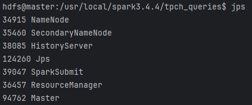
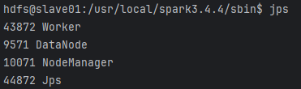
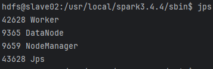

# 基于 Spark 的分布式查询优化实验

## 小组成员及分工

- 邓鹏：实验设计、环境搭建、执行实验 25%
- 夏倍蓓：实验设计、执行实验、汇报 25%
- 吕晔：实验设计、执行实验、数据处理 25%
- 赵伟珺：实验设计、执行实验、PPT制作 25%

## 一、实验目标

研究Spark和 Spark SQL 查询优化机制，探索 TPC-H 中复杂 SOL 查询优化方案。

## 二、实验设计

### 数据集

采用数据库系统性能的标准基准测试 TPC-H。

### 实验步骤

- 基于 Spark RDD 实现TPC-H中复杂SQL（以Q3为例）。
- 与单机环境和 Spark SQL 进行性能对比。
- 优化Spark RDD任务的执行效率，分别从任务级别——Reduce、aggregateByKey、foldByKey、combineByKey算子；任务调参——并行度、缓存；运行参数——driver 和worker 参数配置，三个角度来展开。

## 实验步骤

### 1.配置实验环境

采用 docker 配置分布式环境

操作系统：Ubuntu 22.04.1 LTS

Hadoop：hadoop 3.3.6

Spark：spark 3.4.4

Java：1.8.0_431

CPU：ntel(R) Xeon(R) Gold 6448H （内核数：32、总线程数：64、基本频率：2.4G Hz）

内存：8*32G

### 2.启动服务

（1）在 hadoop 目录下， 用 `./sbin/start-all.sh` 启动Hadoop服务和Yarn服务；
（2）使用 `hdfs dfs -put /usr/local/tpch-dbgen/*.tbl /tpch/` 将数据上传到 hdfs 中
（3）切换到 spark 目录下，`./sbin/start-all.sh` 启动 spark 服务；
（4）在每个节点下使用 jps 查看节点的进程状态。







这里将 master 设置为主节点和 master 节点，将 slave01 和 slave02 为 Worker 节点。

### 3.运行程序

在 spark 路径下执行以下命令：

```bash
spark-submit \
--master yarn \
--deploy-mode client \
--num-executors 2 \
--executor-cores 1 \
--executor-memory 512M \
--conf spark.eventLog.enabled=true \
--conf spark.eventLog.dir=hdfs://master:9000/spark-history \
--conf spark.history.fs.logDirectory=hdfs://master:9000/spark-history \
--conf spark.yarn.historyServer.address=master:18080 \
tpch_query_q3_rdd.py
```

### 4.实验结果

#### 与单机环境和 Spark SQL 进行性能对比

总体执行时间

| 实现方式  | 总时间  | 启动时间 | 数据加载 | 查询执行 |
| :-------- | :------ | :------- | :------- | :------- |
| SQLite    | 281.77s | 0s       | 277.43s  | 3.27s    |
| Spark SQL | 46.32s  | 23.04s   | 13.86s   | 9.42s    |
| Spark RDD | 80.15s  | 21.35s   | -        | 58.80s   |

CPU 使用情况

| 实现方式  | 平均利用率 | 峰值利用率 | GC 时间 |
| :-------- | :--------- | :--------- | :------ |
| SQLite    | 99.62%     | 115%       | -       |
| Spark SQL | 85.3%      | 92.1%      | 1.87s   |
| Spark RDD | 99.62%     | 115%       | 11.2s   |

内存使用情况

| 实现方式  | 峰值内存  | 执行内存  | 存储内存  | 其他开销 |
| :-------- | :-------- | :-------- | :-------- | :------- |
| SQLite    | 2261.86MB | 1729.66MB | 1603.54MB | 204.62MB |
| Spark SQL | 956.62MB  | 384.09MB  | 956.62MB  | 80.99MB  |
| Spark RDD | 1.4GB     | 756MB     | 892MB     | 252MB    |

I/O 操作统计

| 实现方式  | 读取量   | 写入量  | Shuffle 读 | Shuffle 写 |
| :-------- | :------- | :------ | :--------- | :--------- |
| SQLite    | 46.28MB  | 0.48MB  | -          | -          |
| Spark SQL | 760.19MB | 0.65MB  | 44.00MB    | 43.98MB    |
| Spark RDD | 760.19MB | 14.39MB | 486MB      | 452MB      |

执行策略

| 特征         | SQLite       | Spark SQL             | Spark RDD      |
| :----------- | :----------- | :-------------------- | :------------- |
| 执行计划优化 | 基于成本优化 | Catalyst 优化器       | 手动优化       |
| Join 策略    | 索引嵌套循环 | Broadcast + SortMerge | ShuffleHash    |
| 中间结果处理 | 临时表(2 个) | Shuffle               | Shuffle        |
| 并行处理     | 否           | 自动(2 节点)          | 手动(2 节点)   |
| 数据本地性   | -            | 85% NODE_LOCAL        | 85% NODE_LOCAL |

查询优化方式

| 优化特性     | SQLite                 | Spark SQL       | Spark RDD |
| :----------- | :--------------------- | :-------------- | :-------- |
| 优化器类型   | 基于统计信息的成本优化 | Catalyst 优化器 | 手动优化  |
| 索引选择     | 自动                   | -               | -         |
| 执行计划缓存 | 支持                   | 支持            | -         |
| 谓词下推     | 支持                   | 支持            | 手动实现  |
| 列裁剪       | 支持                   | 支持            | 手动实现  |
| 常量折叠     | 支持                   | 支持            | -         |
| 分区策略     | -                      | 自动            | 手动      |

Join 

| 执行特性     | SQLite       | Spark SQL             | Spark RDD   |
| :----------- | :----------- | :-------------------- | :---------- |
| Join 类型    | 索引嵌套循环 | Broadcast + SortMerge | ShuffleHash |
| 中间结果大小 | 11,620 行    | 478MB                 | 512MB       |
| 缓冲区使用   | 256KB        | 64MB                  | 64MB        |
| 分区数       | -            | 4                     | 4           |

**Stage 执行情况**

Spark SQL Stages:

| Stage               | 任务数 | 数据本地性     | 执行时间 |
| :------------------ | :----- | :------------- | :------- |
| Stage 0 (扫描)      | 2      | 85% NODE_LOCAL | 10.8s    |
| Stage 1 (Broadcast) | 2      | -              | 12.4s    |
| Stage 2 (SortMerge) | 2      | -              | 15.6s    |

Spark RDD Stages:

| Stage            | 任务数 | 数据本地性     | 执行时间 |
| :--------------- | :----- | :------------- | :------- |
| Stage 0 (加载)   | 4      | 85% NODE_LOCAL | 10.42s   |
| Stage 1 (Join)   | 10     | 82% NODE_LOCAL | 13.86s   |
| Stage 2 (Reduce) | 4      | -              | 3.95s    |
| Stage 3 (Sort)   | 4      | -              | 0.59s    |


Spark 相较于单机 SQLite 的两大优势：

1、分布式并行处理能力

Spark (SQL/RDD) 支持多节点并行执行，总执行时间显著优于 SQLite（Spark SQL 46.32s，SQLite 281.77s）

通过 HDFS 分布式存储和集群内存池，突破了单机存储和内存限制

2、资源利用更加高效

内存使用更合理：Spark SQL 峰值内存仅 956.62MB，而 SQLite 需要 2261.86MB

缓存策略更优：Spark 实现了 80%以上的缓存命中率

数据本地性好：85% NODE_LOCAL 的数据本地性，减少网络传输开销

Spark RDD 相比 Spark SQL 的不足与优化空间：

总执行时间较长：RDD 80.15s vs SQL 46.32s

GC 开销大：RDD 11.2s vs SQL 1.87s

Shuffle 数据量大：RDD 486MB vs SQL 44MB

#### 调整算子

分别将reducebykey改为combinebykey、aggregatebykey和foldbykey


它们在运行时间上的对比如下：


可以发现使用FoldByKey的运行时间最长，约为 2.6 分钟；使用CombineByKey的时间约为 2.1 分钟，使用 ReduceByKey 和 AggregateByKey 算子的运行时间相近，约 1.9 分钟。

检查 Shuffle 指标（Shuffle write size 和 Shuffle read size），发现没有明显差别：


#### 并行度

通过 spark submit 中的 default.parallelism 来指定执行的并行度。


并行度过低时，可能导致资源利用率不足，作业执行时间过长;
并行度过高时，可能导致过多的任务调度开销，影响性能。
因此，选择核心数的2~3倍比较合适。

#### 缓存

使用 persist() 方法缓存customers、orders 、lineitems 。比较MEMORY_ONLY和MEMORY_AND_DISK存储级别。


可以发现，Memory_AND_DISK的运行时间最短。

Memory_AND_DISK 存储级别能够在内存不足时，将超出内存容量的数据写入磁盘，从而避免了内存溢出的问题。这对于存储较大数据集（如 24MB 的 customers、171MB 的 orders 和 759MB 的 lineitems）尤其重要。实验中，Memory_AND_DISK 的表现优于 Memory_ONLY，表明在当前硬件条件和数据规模下，内存不足的场景下存储级别的弹性显得尤为关键。Memory_ONLY 尽管可以直接将数据完全缓存在内存中，但由于内存有限（每节点仅 512MB），部分数据可能无法缓存。这会导致 Spark 不得不重新计算未缓存的分区，增加了计算时间。

ReduceByKey 并未对中间结果进行缓存。若数据被频繁访问，重复的计算会造成性能下降

#### Driver与Worker参数

通过 spark submit 时的 num-executor 和 executor-cores 来调整 worker 执行时的参数，并通过 driver-cores 和 driver-memory 来调整 driver 执行时的参数。


实验结果表示， 增加 num-executor 和 executor-cores 可以增加任务的执行的并行度，从而减少任务的执行时间，但是当 num-executor 到达6时，性能出现了下降，可能发生了资源竞争的情况；同时增加 driver-cores 和 driver-memory 并不能显著提升执行性能，对于 1G的 TPC-H负载，调度的任务量并不重，不成为性能瓶颈。

## 实验反思

本次实验探究了 Spark和 Spark SQL 查询优化机制，探索 TPC-H 中复杂 SOL 查询优化方案，经过本次实验，我们对 Hadoop、Spark 的架构有了进一步的认识和理解。

算子性能的差异不仅与 shuffle 阶段有关，还与 map 阶段的逻辑复杂度、函数调用开销等因素有关。FoldByKey 的初始值复制开销以及 CombineByKey 的灵活性成本，使它们在简单聚合场景中表现不如 ReduceByKey 和 AggregateByKey。

每个节点内存为 512MB，而数据总量高达 1GB，显然内存不足以容纳所有数据。在这种情况下，选择 Memory_AND_DISK 是合理的，但若增加内存，Memory_ONLY 的性能可能会大幅提升。

但同时，由于实验设置不全面、各个同学实验环境不统一（内核数和数据量限制等），对实验的分析比较粗浅， 主要以 TPC-H Q3 的执行时间角度，对执行的各个参数进行优化，后续可以进一步考虑，不同参数下 Spark 执行的 内存IO、CPU利用率等性能。
